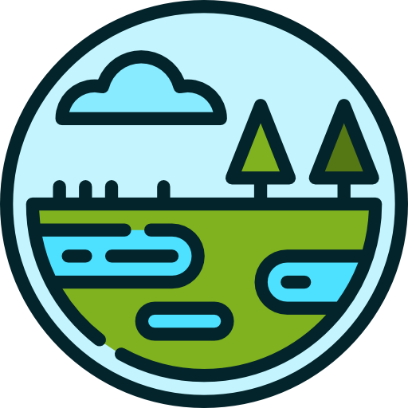

<!-- Improved compatibility of back to top link: See: https://github.com/othneildrew/Best-README-Template/pull/73 -->
<a id="readme-top"></a>
<!--
*** Thanks for checking out the Best-README-Template. If you have a suggestion
*** that would make this better, please fork the repo and create a pull request
*** or simply open an issue with the tag "enhancement".
*** Don't forget to give the project a star!
*** Thanks again! Now go create something AMAZING! :D
-->


<!-- PROJECT SHIELDS -->
<!--
*** I'm using markdown "reference style" links for readability.
*** Reference links are enclosed in brackets [ ] instead of parentheses ( ).
*** See the bottom of this document for the declaration of the reference variables
*** for contributors-url, forks-url, etc. This is an optional, concise syntax you may use.
*** https://www.markdownguide.org/basic-syntax/#reference-style-links
-->

[](#)
[](#)
[](#)
[](#)
[](#)
[](#-license)
[](#)
[](#)

[](https://x.com/intent/tweet?text=Check%20out%20this%20project%20on%20GitHub:%20https://github.com/David05R/wetland-recognition_CO-afina%20%23OpenIDConnect%20%23Security%20%23Authentication)
[](https://www.facebook.com/sharer/sharer.php?u=https://github.com/David05R/wetland-recognition_CO-afina)
[](https://www.linkedin.com/sharing/share-offsite/?url=https://github.com/David05R/wetland-recognition_CO-afina)
[](https://www.reddit.com/submit?title=Check%20out%20this%20project%20on%20GitHub:%20https://github.com/David05R/wetland-recognition_CO-afina)
[](https://t.me/share/url?url=https://github.com/David05R/wetland-recognition_CO-afina&text=Check%20out%20this%20project%20on%20GitHub)

:star: Star us on GitHub — it motivates us a lot!

<!-- PROJECT LOGO -->
<br />
<div align="center">
  <a href="https://github.com/github_username/repo_name">
    
  </a>

<h3 align="center">Reconocimiento Ciudadano de las Transformaciones de Humedales en Colombia</h3>

  <p align="center">
    Descripción:
    <br />
    <a href="https://docs.google.com/presentation/d/16weLUhh8QKx_lN8MphkURAA6tc8OO8Zn/edit#slide=id.p12"><strong>Explorar los documentos»</strong></a>
    <br />
    <br />
  </p>
</div>

<!-- TABLE OF CONTENTS -->
<details>
  <summary>Tabla de contenidos</summary>
  <ol>
    <li>
      <a href="#sobre-el-proyecto">Sobre el proyecto</a>
      <ul>
        <li><a href="#objetivos-del-proyecto">Objetivos del proyecto</a></li>
        <li><a href="#objetivo-general">Objetivo general</a></li>
        <li><a href="#objetivos-específicos">Objetivos especificos</a></li>
        <li><a href="#funcionalidades">Funcionalidades</a></li>
        <li><a href="#detalles-de-implementación">Detalles de Implementación</a></li>
        <li><a href="#creado-con">Creado con</a></li>
      </ul>
    </li>
    <li>
      <a href="#Información-Técnica-sobre-Humedales-y-Sitios-Ramsar">Información Técnica sobre Humedales y Sitios Ramsar</a>
      <ul>
        <li><a href="#humedales">Humedales</a></li>
        <li><a href="#sitios-ramsar">Sitios Ramsar</a></li>
      </ul>
    </li>
    <li>
      <a href="#datasets-utilizados">Datasets Utilizados</a>
    </li>
    <li>
      <a href="#requisitos-previos">Requisitos previos</a>
    </li>
    <li>
      <a href="#primeros-pasos">Primeros pasos</a>
      <ul>
        <li><a href="#instalación">Instalación</a></li>
      </ul>
    </li>
    <li>
      <a href="#despliegue-en-vercel">Despliegue en Vercel</a>
    </li>
    <li>
      <a href="#aprende-más">Aprende más</a>
    </li>
    <li><a href="#contribuir">Contribuir</a></li>
    <li><a href="#contacto">Contacto</a></li>
    <li><a href="#agradecimientos">Agradecimientos</a></li>
  </ol>
</details>


<!-- ABOUT THE PROJECT -->
##  Sobre el proyecto

[![Product Name Screen Shot][product-screenshot]](https://example.com)

Este proyecto tiene como objetivo generar conciencia ciudadana sobre los humedales en Colombia, sus posibles cambios y los factores de riesgo en su preservación. La aplicación digital permite la identificación de estas zonas, su ubicación respecto a áreas de actividad humana o zonas de protección ambiental y la visualización de su transformación en el tiempo.

### Objetivos del Proyecto
### Objetivo General
Generar conciencia ciudadana sobre los humedales en Colombia y los factores de riesgo en su preservación mediante una herramienta amigable.

### Objetivos Específicos
- Clasificar humedales en Colombia según su ubicación en zonas de protección ambiental.
- (Opcional) Clasificar los sitios Ramsar según la densidad de población en los municipios circundantes.
- Construir timelapses de los cambios en los humedales usando datos disponibles en la red.
- Crear una aplicación web con un mapa interactivo de Colombia para observar las regiones Ramsar y los timelapses.

### Funcionalidades
- Mapa interactivo de Colombia con la ubicación de los sitios Ramsar.
- Visualización de timelapses de los humedales.
- Clasificación de humedales según su proximidad a áreas protegidas y densidad de población.


This is a [Next.js](https://nextjs.org/) project bootstrapped with [`create-next-app`](https://github.com/vercel/next.js/tree/canary/packages/create-next-app).


### Detalles de Implementación

Este proyecto utiliza Next.js para el frontend y Python para el procesamiento de datos y la generación de timelapses. La clasificación de humedales se realiza utilizando información tomada y analizada de los sitios web mencionados y la visualización de mapas se implementa con React.js.

Los timelapses se generan utilizando la API de Google Earth Engine, procesando imágenes satelitales históricas para mostrar los cambios en los humedales a lo largo del tiempo.

Para más detalles sobre la implementación, consulte los archivos de código fuente en el repositorio.

Notebook data cleaning:

<a target="_blank" href="https://colab.research.google.com/drive/1Xt5hMikcDaybIifIVriegwWJnDyPF7O3">
  
</a>

### Creado con

* [![Next][Next.js]][Next-url]
* [![React][React.js]][React-url]
* [![Python][Python]][Python-url]
* 
* 


## Información Técnica sobre Humedales y Sitios Ramsar

### Humedales

Los humedales son ecosistemas que permanecen en condiciones de inundación o saturación por agua durante períodos considerables. Se caracterizan por:

1. Hidrología: Presencia de agua en la superficie o cerca de ella, de forma permanente o temporal.
2. Suelos: Suelos hídricos que se desarrollan en condiciones de saturación.
3. Vegetación: Plantas hidrófilas adaptadas a vivir en ambientes acuáticos o de suelos saturados.

Los humedales desempeñan funciones ecológicas cruciales:
- Regulación hídrica
- Hábitat para biodiversidad
- Mitigación del cambio climático (sumideros de carbono)
- Protección contra inundaciones y erosión costera

### Sitios Ramsar

Los Sitios Ramsar son humedales de importancia internacional, designados bajo la Convención de Ramsar sobre los Humedales, un tratado intergubernamental adoptado en 1971. Un sitio Ramsar debe cumplir al menos uno de los nueve criterios de importancia internacional:

1. Contiene un ejemplo representativo, raro o único de un tipo de humedal natural o casi natural en la región biogeográfica apropiada.
2. Sustenta especies vulnerables, en peligro o en peligro crítico, o comunidades ecológicas amenazadas.
3. Sustenta poblaciones de especies importantes para mantener la diversidad biológica de una región biogeográfica determinada.
4. Sustenta especies en una etapa crítica de su ciclo biológico o les ofrece refugio en condiciones adversas.
5. Sustenta de manera regular una población de 20,000 o más aves acuáticas.
6. Sustenta de manera regular el 1% de los individuos de una población de una especie o subespecie de aves acuáticas.
7. Sustenta una proporción significativa de subespecies, especies o familias de peces autóctonas, etapas del ciclo biológico, interacciones de especies y/o poblaciones representativas de los beneficios/valores de los humedales.
8. Es una fuente de alimentación importante para peces, zona de desove, área de desarrollo y crecimiento y/o ruta migratoria de la que dependen las existencias de peces dentro o fuera del humedal.
9. Sustenta habitualmente el 1% de los individuos de la población de una especie o subespecie dependiente de los humedales que sea una especie animal no aviaria.

En Colombia, según los datos proporcionados por la pagina de [Ramsar Sites Information Service](https://rsis.ramsar.org), hay 11 sitios Ramsar que cubren un área total de 936,441.99 hectáreas.

## Datasets Utilizados

| Data                       | URL                | Description                                                                 |
| -------------------------- | ------------------ | --------------------------------------------------------------------------- |
| Sitios Ramsar en el mundo               | https://rsis.ramsar.org/ | Base de dato para obtener información sobre humedales y sitios ramsar en el mundo                                                           |
| Geoportal del DANE                | https://geoportal.dane.gov.co/geovisores/sociedad/cnpv-2018/ |  Entidad responsable de la planeación, levantamiento, procesamiento, análisis y difusión de las estadísticas oficiales de Colombia.                       |
| Departamentos y Ciudades de Colombia           | https://departamentosdecolombia.com/colombia/superficie/     | Información sobre departamentos, ciudades, zonas rurales y urbanas de Colombia                                        |
| Google Earth Engine Timelapse                | https://earthengine.google.com/timelapse/  |             Earth Engine combina un catálogo de varios petabytes de imágenes de satélite y conjuntos de datos geoespaciales con capacidades de análisis a escala planetaria                                                  |

## Requisitos previos

Antes de empezar, comprueba que cumples los siguientes requisitos:

- Tienes instalada versiónes recientes de `< Next.js / React.js >`.
- Dispones de un equipo `<Windows / Linux / Mac>`.
- Ha leído la `< https://nextjs.org/docs/ >`.

## Primeros pasos

Primero, ejecutar el servidor de desarrollo:

```bash
npm run dev
# or
yarn dev
# or
pnpm dev
# or
bun dev
```

Abrir [http://localhost:3000](http://localhost:3000) con tu buscador para ver los resultados.

Puede empezar a editar la página modificando `app/page.js`. La página se actualiza automáticamente a medida que editas el archivo.

Este proyecto usa [`next/font`](https://nextjs.org/docs/basic-features/font-optimization) para optimizar y cargar automáticamente Inter, una fuente personalizada de Google.


## Despliegue en Vercel

La forma más sencilla de desplegar la aplicación Next.js es utilizar el módulo [Vercel Platform](https://vercel.com/new?utm_medium=default-template&filter=next.js&utm_source=create-next-app&utm_campaign=create-next-app-readme) de los creadores de Next.js.


## Aprende más

Para saber más sobre Next.js, eche un vistazo a los siguientes recursos:

- [Next.js Documentation](https://nextjs.org/docs) - conozca las características y la API de Next.js.
- [Learn Next.js](https://nextjs.org/learn) - un tutorial interactivo de Next.js.


<!-- CONTRIBUTING -->
## Contribuciones

Las contribuciones son lo que hace que la comunidad de código abierto sea un lugar increíble para aprender, inspirar y crear. Cualquier contribución que hagas será **muy apreciada**.

Si tiene alguna sugerencia que pueda mejorar esto, por favor haga un fork del repositorio y cree un pull request. También puedes abrir una incidencia con la etiqueta «enhancement».
No olvides darle una estrella al proyecto ⭐. Gracias de nuevo. :raised_hands:

1. Fork al proyecto (https://github.com/David05R/wetland-recognition_CO-afina)
2. Cree su rama de funciones (`git checkout -b feature/AmazingFeature`)
3. Confirme sus cambios (`git commit -m 'Add some AmazingFeature'`)
4. Haga un push a la rama(`git push origin feature/AmazingFeature`)
5. Abrir una Pull Request


<!-- CONTACT -->
## Contacto

Para más detalles no dude en ponerse en contacto con nosotros. Estamos a su disposición para ayudarle y responder a sus preguntas. A continuación se indican las mejores formas de ponerse en contacto con nuestro equipo:

* [📧](#) santiagoqp3103@gmail.com
* [📧](#) herreraacevedodl@gmail.com
* [📧](#) dvjruiz2003ybsj@gmail.com
* [📧](#) isabellaarrietag@gmail.com
* [📧](#) Vizcainoadrian2003@gmail.com


<!-- ACKNOWLEDGMENTS -->
## Agradecimientos 

* [Ramsar Sites Information Service](https://rsis.ramsar.org/) por los datos de los sitios Ramsar.
* [DANE](https://www.dane.gov.co/) por los datos demográficos y geoespaciales de Colombia.
* [Google Earth Engine](https://earthengine.google.com/) por la plataforma de procesamiento de imágenes satelitales
* [CoAfina 2024](https://laconga.redclara.net/hackathon/#/) y a los retadores que propusieron el reto por la oportunidad que nos dan al participar en este evento
* Todos los contribuyentes que han participado en este proyecto.

<p align="right">(<a href="#readme-top">back to top</a>)</p>


<!-- MARKDOWN LINKS & IMAGES -->
<!-- https://www.markdownguide.org/basic-syntax/#reference-style-links -->
[contributors-shield]: https://img.shields.io/github/contributors/github_username/repo_name.svg?style=for-the-badge
[contributors-url]: https://github.com/github_username/repo_name/graphs/contributors
[forks-shield]: https://img.shields.io/github/forks/github_username/repo_name.svg?style=for-the-badge
[forks-url]: https://github.com/github_username/repo_name/network/members
[stars-shield]: https://img.shields.io/github/stars/github_username/repo_name.svg?style=for-the-badge
[stars-url]: https://github.com/github_username/repo_name/stargazers
[issues-shield]: https://img.shields.io/github/issues/github_username/repo_name.svg?style=for-the-badge
[issues-url]: https://github.com/github_username/repo_name/issues
[license-shield]: https://img.shields.io/github/license/github_username/repo_name.svg?style=for-the-badge
[license-url]: https://github.com/github_username/repo_name/blob/master/LICENSE.txt
[linkedin-shield]: https://img.shields.io/badge/-LinkedIn-black.svg?style=for-the-badge&logo=linkedin&colorB=555
[linkedin-url]: https://linkedin.com/in/linkedin_username
[product-screenshot]: images/screenshot.png
[Next.js]: https://img.shields.io/badge/next.js-000000?style=for-the-badge&logo=nextdotjs&logoColor=white
[Next-url]: https://nextjs.org/
[Python]: https://img.shields.io/badge/python-3670A0?style=for-the-badge&logo=python&logoColor=ffdd54
[Python-url]: https://www.python.org/
[React.js]: https://img.shields.io/badge/React-20232A?style=for-the-badge&logo=react&logoColor=61DAFB
[React-url]: https://reactjs.org/
[Vue.js]: https://img.shields.io/badge/Vue.js-35495E?style=for-the-badge&logo=vuedotjs&logoColor=4FC08D
[Vue-url]: https://vuejs.org/
[Angular.io]: https://img.shields.io/badge/Angular-DD0031?style=for-the-badge&logo=angular&logoColor=white
[Angular-url]: https://angular.io/
[Svelte.dev]: https://img.shields.io/badge/Svelte-4A4A55?style=for-the-badge&logo=svelte&logoColor=FF3E00
[Svelte-url]: https://svelte.dev/
[Laravel.com]: https://img.shields.io/badge/Laravel-FF2D20?style=for-the-badge&logo=laravel&logoColor=white
[Laravel-url]: https://laravel.com
[Bootstrap.com]: https://img.shields.io/badge/Bootstrap-563D7C?style=for-the-badge&logo=bootstrap&logoColor=white
[Bootstrap-url]: https://getbootstrap.com
[JQuery.com]: https://img.shields.io/badge/jQuery-0769AD?style=for-the-badge&logo=jquery&logoColor=white
[JQuery-url]: https://jquery.com 